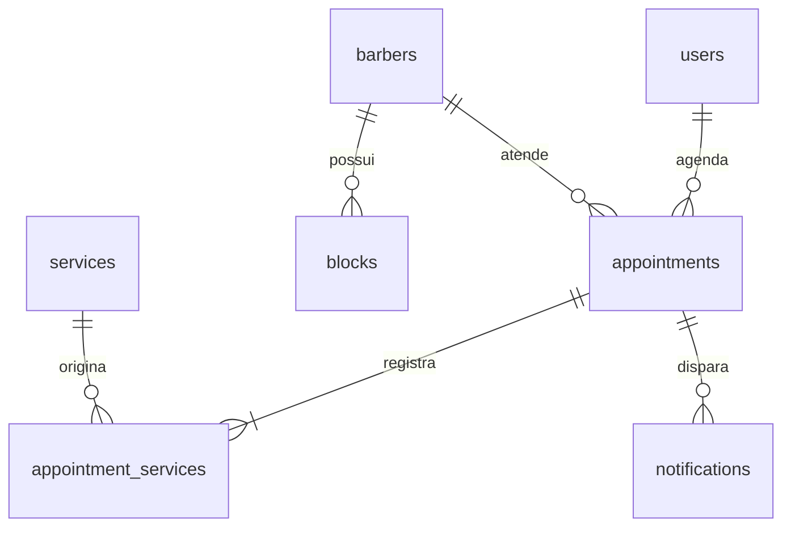

# Arquitetura, rotas e regras

## Páginas

| Rota                    | Conteúdo                                         | Acesso                    |
| ----------------------- | ------------------------------------------------ | ------------------------- |
| `/`                     | Landing page, serviços, galeria, sobre e contato | Público                   |
| `/agendar?servico=:id`  | Fluxo de agendamento com serviço pré-selecionado | Público até a confirmação |
| `/agendar?remarcar=:id` | Remarcação de reserva futura                     | Proprietário autenticado  |
| `/minha-conta`          | Login/cadastro ou lista de reservas e histórico  | Própria conta             |
| `/admin`                | Visão geral                                      | Administrador             |
| `/admin/agenda`         | Dia, semana, mês, status e bloqueios             | Administrador             |
| `/admin/servicos`       | CRUD de catálogo                                 | Administrador             |
| `/admin/financeiro`     | KPIs, gráficos e exportação                      | Administrador             |

## Contrato HTTP

Toda rota usa prefixo `/api`. Erros retornam `{ "error": "mensagem" }`; validações também podem incluir `details` com campos. Status 400 para dados inválidos, 401 para falta de sessão, 403 para papel/origem proibidos, 404 para recurso não encontrado, 409 para disputa de horário/e-mail duplicado e 412 para preço/duração alterados.

| Método | Rota                                                               | Regra                                                                                        |
| ------ | ------------------------------------------------------------------ | -------------------------------------------------------------------------------------------- |
| GET    | `/health`                                                          | Saúde e dialeto do banco                                                                     |
| GET    | `/config`                                                          | Expediente, demo e canais configurados, sem credenciais                                      |
| GET    | `/services`                                                        | Serviços ativos                                                                              |
| GET    | `/barbers`                                                         | Profissionais ativos                                                                         |
| GET    | `/availability?date=YYYY-MM-DD&barberId=igor&services=corte,barba` | Intervalos que acomodam todos os serviços; `except` só é considerado para proprietário/admin |
| POST   | `/auth/register`                                                   | `{name,email,phone,password}`; cria cliente, nunca administrador                             |
| POST   | `/auth/login`                                                      | `{email,password}`; cookie JWT HttpOnly SameSite=Lax                                         |
| GET    | `/auth/me`                                                         | `{user}` público sanitizado ou null                                                          |
| POST   | `/auth/logout`                                                     | Apaga cookie                                                                                 |
| GET    | `/appointments`                                                    | Reservas somente do usuário autenticado                                                      |
| POST   | `/appointments`                                                    | `{services:[id],barberId,date,time,expectedTotal?,expectedDuration?}`                        |
| PATCH  | `/appointments/:id/reschedule`                                     | Mesmo corpo da criação; proprietário, futuro, confirmado                                     |
| PATCH  | `/appointments/:id/cancel`                                         | Proprietário, futuro, confirmado                                                             |
| GET    | `/admin/appointments?from=YYYY-MM-DD&to=YYYY-MM-DD`                | Lista com cliente, serviços e profissional                                                   |
| PATCH  | `/admin/appointments/:id/status`                                   | `{status:"completed"                                                                         | "cancelled" | "no-show"}` |
| POST   | `/admin/services`                                                  | `{name,description,duration,price,category}`; preço em centavos                              |
| PUT    | `/admin/services/:id`                                              | Mesmos campos; altera somente o catálogo                                                     |
| DELETE | `/admin/services/:id`                                              | Exclusão lógica (`active=0`)                                                                 |
| GET    | `/admin/blocks?from=...&to=...`                                    | Bloqueios no período                                                                         |
| POST   | `/admin/blocks`                                                    | `{barberId,date,start:"12:00",end:"13:00",reason}`                                           |
| DELETE | `/admin/blocks/:id`                                                | Libera intervalo                                                                             |
| GET    | `/admin/metrics`                                                   | KPIs e séries calculados no servidor                                                         |
| GET    | `/admin/notifications`                                             | Contagem por canal e estado                                                                  |

## Modelo de dados



- `users`: UUID, nome, e-mail único normalizado, telefone, hash bcrypt, papel, criação.
- `barbers`: identificador, nome, especialidade, ativo. O seed cria Igor Borges; podem ser incluídos profissionais no banco.
- `services`: descrição, categoria, duração em minutos inteiros, preço em centavos, ativo.
- `appointments`: proprietário, profissional, data local ISO, minuto inicial/final, total em centavos, estado, criação.
- `appointment_services`: snapshot de nome, preço e duração no momento da reserva. Chave composta impede repetição do mesmo serviço.
- `blocks`: profissional, data, início/fim em minutos, motivo.
- `notifications`: canal, evento, payload congelado, status, tentativas, erro resumido, próxima tentativa. Nenhuma credencial é armazenada no payload.

Veja o esquema executável em [`server/schema.sql`](../server/schema.sql). Datas usam texto ISO para a mesma implementação funcionar nos dois bancos. As chaves estrangeiras ficam habilitadas também no SQLite.

## Disponibilidade e consistência

O intervalo de uma reserva é semiaberto `[início, fim)`. Existe conflito quando `novoInicio < fimExistente && novoFim > inicioExistente`. Logo, terminar às 10h permite que outro atendimento comece às 10h.

O servidor soma as durações e os preços do catálogo; nunca confia em um total enviado pelo cliente. `expectedTotal` e `expectedDuration` permitem interromper a confirmação se o catálogo tiver mudado após a seleção. Também valida profissional, serviços ativos, domingo, expediente, horários já passados, grade de 30 minutos e horizonte de 90 dias.

Na transação, a agenda é bloqueada, a disponibilidade é recalculada e a reserva, seus snapshots e a outbox são gravados juntos. Agendamentos `confirmed` e `completed` ocupam o intervalo. Cancelamentos liberam o horário. Um bloqueio sobre reserva existente é rejeitado.

O administrador pode finalizar somente uma reserva confirmada. Conclusão exige término do intervalo; ausência exige que o horário inicial tenha chegado. Estados finais não podem ser reabertos por esta versão. Uma remarcação mantém o ID, recalcula os serviços e gera um novo evento com payload congelado.

## Cálculos financeiros

Todos os cálculos usam inteiros em centavos e exclusivamente `status='completed'`.

```text
receita(periodo) = soma(appointment.total de concluídos no período)
ticketMedio = arredondar(receita dos últimos 30 dias / número de atendimentos concluídos)
clientesUnicos = quantidade distinta de user_id nos últimos 30 dias
melhorDiaReceita = dia da semana com maior soma de receita nos últimos 30 dias
melhorDiaVolume = dia da semana com mais atendimentos concluídos nos últimos 30 dias
maisVendido = serviço com mais snapshots em atendimentos concluídos no período
```

O ticket é por atendimento, portanto um mesmo cliente com duas visitas representa dois tickets; a métrica de clientes únicos é separada. Semana começa na segunda-feira. Mês e ano são períodos civis até hoje. O gráfico e CSV mostram 14 dias, incluindo dias de receita zero. Esse faturamento é receita de serviços realizados; não é lucro e não inclui gestão de despesas, impostos ou conciliação de pagamentos.

## Segurança

Hashes bcrypt com custo 12, JWT HS256 com issuer/audience/expiração e segredo apenas no servidor; cookie HttpOnly, SameSite=Lax e Secure em produção. A autorização é reavaliada na API consultando a conta no banco. Cadastro não permite elevação de papel. Toda consulta que aceita identificadores usa parâmetros. Reservas de outros usuários não são expostas ao cliente.

Helmet aplica cabeçalhos e CSP na distribuição de produção. Mutações com `Origin` diferente de `APP_URL` são rejeitadas; não há CORS aberto. Rate limiting geral e para tentativas de autenticação. APIs não são armazenadas em cache. A versão usa sessões de sete dias sem revogação global imediata, recuperação de senha ou verificação de e-mail; essas extensões estão fora do fluxo solicitado.
